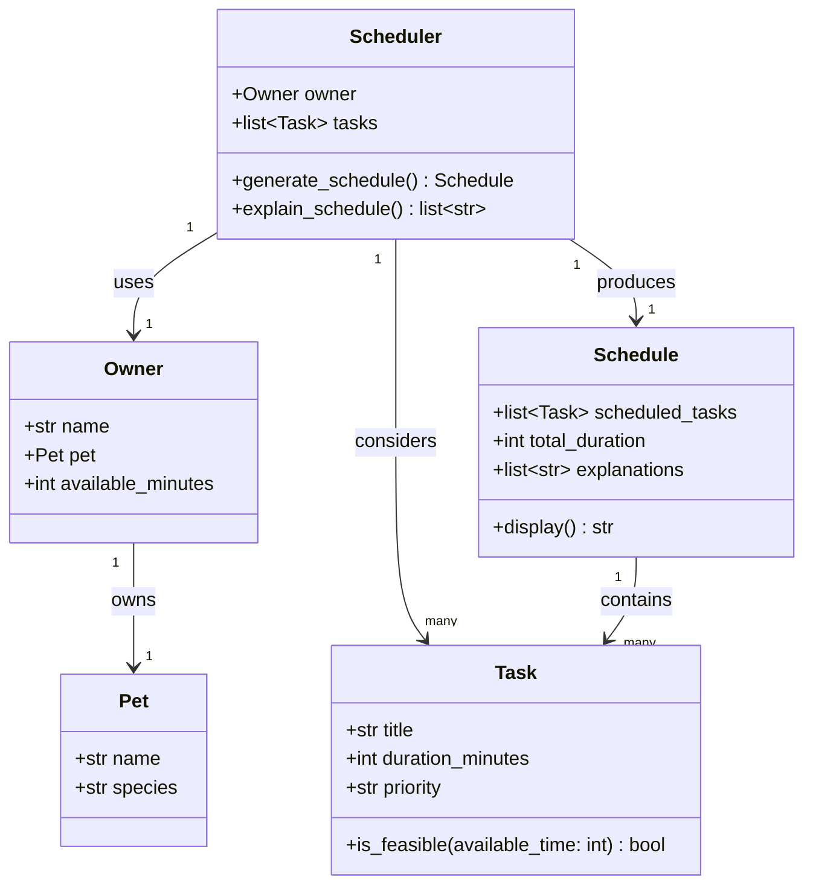

# PawPal+ Project Reflection

## 1. System Design

**a. Initial design**

My initial design uses five classes organized around a clear separation of data and behavior. The data classes (`Pet`, `Task`, `Owner`) hold information with no scheduling logic. The behavior classes (`Scheduler`, `Schedule`) contain all the decision-making and output.

- **`Pet`** is a simple data container. Its only responsibility is to hold the pet's name and species so the scheduler has context about who is being cared for.
- **`Task`** represents a single care item. It is responsible for knowing what needs to happen, how long it takes, and how urgent it is. It also knows how to check whether it fits within a remaining time budget (`is_feasible`).
- **`Owner`** groups the person's name, their pet, and how much time they have available in a day. It acts as the entry point for all scheduling inputs.
- **`Scheduler`** is the core engine. It takes an `Owner` and a list of `Task`s and is responsible for deciding which tasks to include, in what order, and for producing a `Schedule` object as output. It also generates plain-language explanations for those decisions.
- **`Schedule`** is the output object. Its responsibility is to hold the final ordered list of tasks, the total time they consume, and the explanations — and to format all of that for display in the UI.

The three core actions a user should be able to perform in PawPal+:

1. **Add a pet** — The user registers their pet by providing a name and species. This gives the system the context it needs to personalize the schedule and apply species-appropriate defaults or constraints.

2. **Add care tasks** — The user enters individual tasks (such as a morning walk, feeding, or medication) along with how long each task takes and how important it is. This builds the pool of tasks the scheduler will draw from.

3. **Generate today's schedule** — The user requests a daily plan. The system selects and orders tasks based on their priority and duration, fits them within the owner's available time, and explains why each task was included and when it should happen.

**Building blocks — classes, attributes, and methods:**

- **Task** — holds the details of a single care item.
  - Attributes: `title` (str), `duration_minutes` (int), `priority` (str: low / medium / high)
  - Methods: `is_feasible(available_time)` — returns True if the task fits within the remaining time budget

- **Pet** — stores information about the pet being cared for.
  - Attributes: `name` (str), `species` (str)

- **Owner** — represents the person managing the schedule.
  - Attributes: `name` (str), `pet` (Pet), `available_minutes` (int)

- **Scheduler** — the core engine that produces a daily plan.
  - Attributes: `owner` (Owner), `tasks` (list of Task)
  - Methods: `generate_schedule()` — selects and orders feasible tasks by priority; `explain_schedule()` — returns a human-readable explanation for why each task was included

- **Schedule** — the output object returned by the Scheduler.
  - Attributes: `scheduled_tasks` (ordered list of Task), `total_duration` (int), `explanations` (list of str)
  - Methods: `display()` — formats the plan for the UI

**UML Class Diagram:**

**b. Design changes**

After reviewing the class skeletons, three issues were identified and fixed:

1. **Removed `explain_schedule()` from `Scheduler`** — The original design had both `generate_schedule()` (which returns a `Schedule` that already holds `explanations`) and a separate `explain_schedule()` method on `Scheduler`. This created ambiguity: explanations would exist in two places and could diverge. The fix was to remove `explain_schedule()` and have `generate_schedule()` build and attach explanations directly to the `Schedule` it returns. There is now one source of truth.

2. **Added `owner` to `Schedule`** — The original `Schedule` had no reference back to the `Owner` who requested it. This meant `display()` could not say whose plan it was or what the time budget was. Adding `owner` as an attribute closes the missing relationship between `Schedule` and `Owner` that existed in the logic but not in the code.

3. **Made `total_duration` a computed `@property`** — Storing `total_duration` as a plain `int` passed into `__init__` risked it going out of sync if `scheduled_tasks` was ever modified after construction. As a `@property` that sums `duration_minutes` across `scheduled_tasks`, it is always accurate with no extra bookkeeping.

**Phase 2 changes — implementing the full logic:**

4. **`Task` gained `frequency`, `completed`, and `mark_complete()`** — The Phase 1 skeleton only captured what a task was and whether it could fit in time. Real pet care tasks recur on schedules (daily feeding, weekly grooming) and need to be tracked as done. Adding `frequency` captures recurrence intent; `completed` and `mark_complete()` let the scheduler skip already-finished tasks without removing them from the pet's list.

5. **`Pet` became the owner of its tasks** — In Phase 1, tasks were passed directly to `Scheduler` as a flat list with no connection to a specific animal. This made multi-pet support impossible and lost the context of which task belonged to which pet. Moving `tasks: list[Task]` onto `Pet` (with `add_task()`) gives each pet clear ownership of its care items.

6. **`Owner` now manages multiple pets** — Phase 1 `Owner` held exactly one `Pet` as `self.pet`. Phase 2 replaces this with `self.pets: list[Pet]` and adds `add_pet()` and `get_all_tasks()`. The `get_all_tasks()` method provides a single aggregation point so the scheduler never needs to know how many pets exist — it just asks the owner.

7. **`Scheduler` constructor no longer takes a `tasks` list** — Phase 1 `Scheduler.__init__` accepted `(owner, tasks)`. Phase 2 accepts only `(owner)` and calls `owner.get_all_tasks()` inside `generate_schedule()`. This removes the risk of the caller passing a stale or mismatched task list and ensures the scheduler always sees the current live state of all pets.

---

## 2. Scheduling Logic and Tradeoffs

**a. Constraints and priorities**

- What constraints does your scheduler consider (for example: time, priority, preferences)?
- How did you decide which constraints mattered most?

**b. Tradeoffs**

- Describe one tradeoff your scheduler makes.
- Why is that tradeoff reasonable for this scenario?

---

## 3. AI Collaboration

**a. How you used AI**

- How did you use AI tools during this project (for example: design brainstorming, debugging, refactoring)?
- What kinds of prompts or questions were most helpful?

**b. Judgment and verification**

- Describe one moment where you did not accept an AI suggestion as-is.
- How did you evaluate or verify what the AI suggested?

---

## 4. Testing and Verification

**a. What you tested**

- What behaviors did you test?
- Why were these tests important?

**b. Confidence**

- How confident are you that your scheduler works correctly?
- What edge cases would you test next if you had more time?

---

## 5. Reflection

**a. What went well**

- What part of this project are you most satisfied with?

**b. What you would improve**

- If you had another iteration, what would you improve or redesign?

**c. Key takeaway**

- What is one important thing you learned about designing systems or working with AI on this project?
