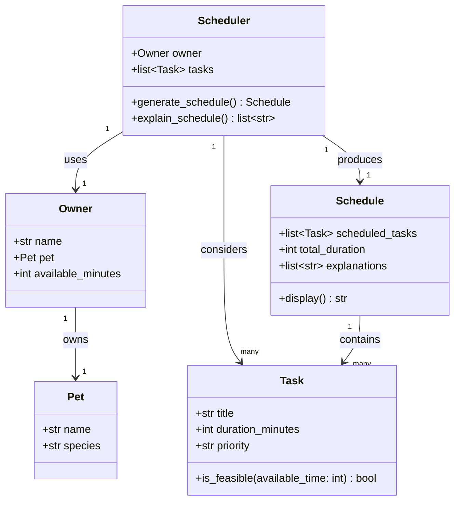

# PawPal+ Project Reflection

## 1. System Design

**a. Initial design**

The three core actions a user should be able to perform in PawPal+:

1. **Add a pet** — The user registers their pet by providing a name and species. This gives the system the context it needs to personalize the schedule and apply species-appropriate defaults or constraints.

2. **Add care tasks** — The user enters individual tasks (such as a morning walk, feeding, or medication) along with how long each task takes and how important it is. This builds the pool of tasks the scheduler will draw from.

3. **Generate today's schedule** — The user requests a daily plan. The system selects and orders tasks based on their priority and duration, fits them within the owner's available time, and explains why each task was included and when it should happen.

**Building blocks — classes, attributes, and methods:**

- **Task** — holds the details of a single care item.
  - Attributes: `title` (str), `duration_minutes` (int), `priority` (str: low / medium / high)
  - Methods: `is_feasible(available_time)` — returns True if the task fits within the remaining time budget

- **Pet** — stores information about the pet being cared for.
  - Attributes: `name` (str), `species` (str)

- **Owner** — represents the person managing the schedule.
  - Attributes: `name` (str), `pet` (Pet), `available_minutes` (int)

- **Scheduler** — the core engine that produces a daily plan.
  - Attributes: `owner` (Owner), `tasks` (list of Task)
  - Methods: `generate_schedule()` — selects and orders feasible tasks by priority; `explain_schedule()` — returns a human-readable explanation for why each task was included

- **Schedule** — the output object returned by the Scheduler.
  - Attributes: `scheduled_tasks` (ordered list of Task), `total_duration` (int), `explanations` (list of str)
  - Methods: `display()` — formats the plan for the UI

**UML Class Diagram:**

**b. Design changes**

- Did your design change during implementation?
- If yes, describe at least one change and why you made it.

---

## 2. Scheduling Logic and Tradeoffs

**a. Constraints and priorities**

- What constraints does your scheduler consider (for example: time, priority, preferences)?
- How did you decide which constraints mattered most?

**b. Tradeoffs**

- Describe one tradeoff your scheduler makes.
- Why is that tradeoff reasonable for this scenario?

---

## 3. AI Collaboration

**a. How you used AI**

- How did you use AI tools during this project (for example: design brainstorming, debugging, refactoring)?
- What kinds of prompts or questions were most helpful?

**b. Judgment and verification**

- Describe one moment where you did not accept an AI suggestion as-is.
- How did you evaluate or verify what the AI suggested?

---

## 4. Testing and Verification

**a. What you tested**

- What behaviors did you test?
- Why were these tests important?

**b. Confidence**

- How confident are you that your scheduler works correctly?
- What edge cases would you test next if you had more time?

---

## 5. Reflection

**a. What went well**

- What part of this project are you most satisfied with?

**b. What you would improve**

- If you had another iteration, what would you improve or redesign?

**c. Key takeaway**

- What is one important thing you learned about designing systems or working with AI on this project?
