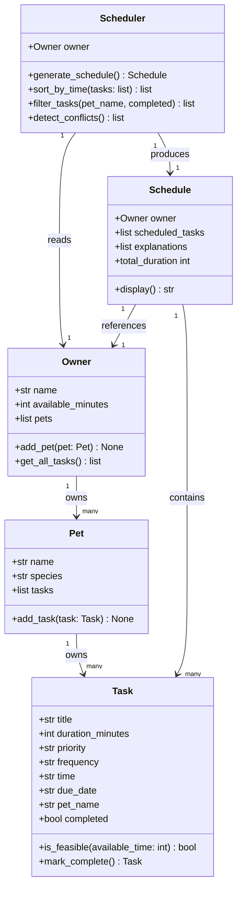

# PawPal+ Project Reflection

## 1. System Design

**a. Initial design**

My initial design uses five classes organized around a clear separation of data and behavior. The data classes (`Pet`, `Task`, `Owner`) hold information with no scheduling logic. The behavior classes (`Scheduler`, `Schedule`) contain all the decision-making and output.

- **`Pet`** is a simple data container. Its only responsibility is to hold the pet's name and species so the scheduler has context about who is being cared for.
- **`Task`** represents a single care item. It is responsible for knowing what needs to happen, how long it takes, and how urgent it is. It also knows how to check whether it fits within a remaining time budget (`is_feasible`).
- **`Owner`** groups the person's name, their pet, and how much time they have available in a day. It acts as the entry point for all scheduling inputs.
- **`Scheduler`** is the core engine. It takes an `Owner` and a list of `Task`s and is responsible for deciding which tasks to include, in what order, and for producing a `Schedule` object as output. It also generates plain-language explanations for those decisions.
- **`Schedule`** is the output object. Its responsibility is to hold the final ordered list of tasks, the total time they consume, and the explanations — and to format all of that for display in the UI.

The three core actions a user should be able to perform in PawPal+:

1. **Add a pet** — The user registers their pet by providing a name and species. This gives the system the context it needs to personalize the schedule and apply species-appropriate defaults or constraints.

2. **Add care tasks** — The user enters individual tasks (such as a morning walk, feeding, or medication) along with how long each task takes and how important it is. This builds the pool of tasks the scheduler will draw from.

3. **Generate today's schedule** — The user requests a daily plan. The system selects and orders tasks based on their priority and duration, fits them within the owner's available time, and explains why each task was included and when it should happen.

**Building blocks — classes, attributes, and methods:**

- **Task** — holds the details of a single care item.
  - Attributes: `title` (str), `duration_minutes` (int), `priority` (str: low / medium / high)
  - Methods: `is_feasible(available_time)` — returns True if the task fits within the remaining time budget

- **Pet** — stores information about the pet being cared for.
  - Attributes: `name` (str), `species` (str)

- **Owner** — represents the person managing the schedule.
  - Attributes: `name` (str), `pet` (Pet), `available_minutes` (int)

- **Scheduler** — the core engine that produces a daily plan.
  - Attributes: `owner` (Owner), `tasks` (list of Task)
  - Methods: `generate_schedule()` — selects and orders feasible tasks by priority; `explain_schedule()` — returns a human-readable explanation for why each task was included

- **Schedule** — the output object returned by the Scheduler.
  - Attributes: `scheduled_tasks` (ordered list of Task), `total_duration` (int), `explanations` (list of str)
  - Methods: `display()` — formats the plan for the UI

**UML Class Diagram (final — updated to match implementation):**

> To export as `uml_final.png`: paste the Mermaid source above into [mermaid.live](https://mermaid.live), then use the Download PNG button.

**b. Design changes**

After reviewing the class skeletons, three issues were identified and fixed:

1. **Removed `explain_schedule()` from `Scheduler`** — The original design had both `generate_schedule()` (which returns a `Schedule` that already holds `explanations`) and a separate `explain_schedule()` method on `Scheduler`. This created ambiguity: explanations would exist in two places and could diverge. The fix was to remove `explain_schedule()` and have `generate_schedule()` build and attach explanations directly to the `Schedule` it returns. There is now one source of truth.

2. **Added `owner` to `Schedule`** — The original `Schedule` had no reference back to the `Owner` who requested it. This meant `display()` could not say whose plan it was or what the time budget was. Adding `owner` as an attribute closes the missing relationship between `Schedule` and `Owner` that existed in the logic but not in the code.

3. **Made `total_duration` a computed `@property`** — Storing `total_duration` as a plain `int` passed into `__init__` risked it going out of sync if `scheduled_tasks` was ever modified after construction. As a `@property` that sums `duration_minutes` across `scheduled_tasks`, it is always accurate with no extra bookkeeping.

**Phase 2 changes — implementing the full logic:**

4. **`Task` gained `frequency`, `completed`, and `mark_complete()`** — The Phase 1 skeleton only captured what a task was and whether it could fit in time. Real pet care tasks recur on schedules (daily feeding, weekly grooming) and need to be tracked as done. Adding `frequency` captures recurrence intent; `completed` and `mark_complete()` let the scheduler skip already-finished tasks without removing them from the pet's list.

5. **`Pet` became the owner of its tasks** — In Phase 1, tasks were passed directly to `Scheduler` as a flat list with no connection to a specific animal. This made multi-pet support impossible and lost the context of which task belonged to which pet. Moving `tasks: list[Task]` onto `Pet` (with `add_task()`) gives each pet clear ownership of its care items.

6. **`Owner` now manages multiple pets** — Phase 1 `Owner` held exactly one `Pet` as `self.pet`. Phase 2 replaces this with `self.pets: list[Pet]` and adds `add_pet()` and `get_all_tasks()`. The `get_all_tasks()` method provides a single aggregation point so the scheduler never needs to know how many pets exist — it just asks the owner.

7. **`Scheduler` constructor no longer takes a `tasks` list** — Phase 1 `Scheduler.__init__` accepted `(owner, tasks)`. Phase 2 accepts only `(owner)` and calls `owner.get_all_tasks()` inside `generate_schedule()`. This removes the risk of the caller passing a stale or mismatched task list and ensures the scheduler always sees the current live state of all pets.

---

## 2. Scheduling Logic and Tradeoffs

**a. Constraints and priorities**

The scheduler considers two hard constraints and one ordering constraint:

1. **Time budget (hard)** — no task is included unless its `duration_minutes` fits within the remaining available time. This is the most consequential constraint: a pet owner's day is finite, so every minute over budget is a real cost.
2. **Completion status (hard)** — tasks already marked `completed=True` are filtered out before scheduling runs. This prevents double-scheduling finished work without requiring deletion.
3. **Priority (ordering)** — high-priority tasks are evaluated first (`PRIORITY_ORDER = {"high": 0, "medium": 1, "low": 2}`). If two tasks would both fit, the higher-priority one is guaranteed a spot first.

Priority was chosen as the primary ordering signal because pet owners distinguish urgency (medication vs. enrichment) even when both tasks technically fit. Time is the binding gate — priority only determines who goes through the gate first.

**b. Tradeoffs**

The conflict detector checks for exact `HH:MM` string matches only. Two tasks scheduled at "09:00" (30 min) and "09:15" (20 min) would not be flagged even though they overlap in real time. Detecting overlap by duration would require computing each task's end time (`start_time + duration`) and checking intervals for intersection — adding meaningful complexity for a single-owner, low-volume app. Exact-time matching catches the most obvious conflicts (double-booking the same slot) without the extra arithmetic, and a warning message is returned rather than raising an exception, so the app never crashes on a conflict.

---

## 3. AI Collaboration

**a. How you used AI**

AI (Claude Code / VS Code Copilot) played three distinct roles across phases:

- **Design brainstorming (Phase 1):** Used AI to convert UML descriptions into Python class stubs, then reviewed each stub against the original design intent before accepting it. Prompts like "generate a Python dataclass for Task with these attributes" were fast, but the class relationships required manual review.
- **Algorithm generation (Phase 3):** Asked for a lambda-based sort for HH:MM strings and for `timedelta` date arithmetic. The most effective prompts were narrow and specific — "using Python's `sorted()` with a lambda key, sort these Task objects by `time` in HH:MM format" produced usable code immediately, whereas vague prompts like "help me sort tasks" produced generic examples that needed adaptation.
- **Refactoring and test generation (Phase 3–4):** Used AI to propose test cases for edge conditions (untimed tasks sorting last, `as-needed` returning `None`) and to suggest the `st.expander` pattern for collapsible schedule notes in Streamlit.

The most valuable Copilot feature was inline chat with `#file:pawpal_system.py` for context — it meant suggestions were grounded in the actual class signatures rather than generic Python patterns.

**b. Judgment and verification**

When implementing recurring tasks, Copilot's initial suggestion mutated the original task in place — it overwrote `due_date` with the next date and returned `self`. This was rejected immediately because a completed task must preserve its original `due_date` as a historical record; overwriting it would make it impossible to know when the task was actually due. The fix was to construct and return a brand-new `Task` instance with `completed=False` and the advanced `due_date`, leaving the original task unchanged.

Verification: after implementing the correct approach, a unit test (`test_mark_complete_daily_returns_next_task`) confirmed that the original task's `due_date` remained `"2026-03-30"` while the returned task's `due_date` was `"2026-03-31"`. The test would have caught the mutation bug immediately.

---

## 4. Testing and Verification

**a. What you tested**

12 unit tests cover:

| Behavior | Why it matters |
|---|---|
| `mark_complete()` sets `completed=True` | Core state change — everything downstream depends on this |
| `add_task()` increases `pet.tasks` count | Verifies tasks are actually stored |
| `add_task()` stamps `pet_name` on the task | Required for filtering and conflict display |
| Daily task returns next occurrence +1 day | Recurrence math must be exact |
| Weekly task returns next occurrence +7 days | Same — date arithmetic must not drift |
| As-needed task returns `None` | No ghost tasks for one-off events |
| `sort_by_time()` orders HH:MM ascending | Time-sorted view requires correct ordering |
| Untimed tasks sort after all timed tasks | Default sentinel `"99:99"` must push them last |
| `filter_tasks(pet_name=...)` returns only that pet | Filter correctness for multi-pet owners |
| `filter_tasks(completed=True/False)` splits correctly | Pending/done split drives the mark-complete UI |
| `detect_conflicts()` finds same-time clash | Core safety feature must not silently miss conflicts |
| `detect_conflicts()` returns `[]` on clean data | Must not produce false positives |

These tests were important because the features interact: filtering feeds the mark-complete UI, which calls `mark_complete()`, which returns a new task that must have its `pet_name` set correctly for `add_task()` to stamp it. Testing each step independently made the integration behavior predictable.

**b. Confidence**

High confidence for covered behaviors. Known gaps to test next:

- `generate_schedule()` with a time budget of 0 (should schedule nothing)
- Tasks where all priorities are equal (ordering should be stable)
- `detect_conflicts()` with three tasks at the same time (only one pair should be reported per time slot in the current implementation)
- Recurring task where `due_date` is empty (falls back to `date.today()` — this path is tested indirectly but not explicitly)

---

## 5. Reflection

**a. What went well**

The separation between data classes (`Task`, `Pet`, `Owner`) and behavior classes (`Scheduler`, `Schedule`) held up across all four phases without requiring a structural rewrite. New features — sorting, filtering, conflict detection, recurring tasks — were added as new methods on `Scheduler` and new fields on `Task` without touching existing logic. That stability is the strongest signal that the initial design was sound.

**b. What you would improve**

The conflict detector only catches exact `HH:MM` matches. A pet owner with a 30-minute walk at 09:00 and a 20-minute vet prep at 09:15 would see no warning, even though those tasks overlap until 09:30. The improvement would be storing an end time (`start + duration`) on each task and checking for interval intersection instead of string equality. I would also add a `time` field to the Streamlit UI's task form earlier (Phase 2) rather than retrofitting it in Phase 4.

**c. Key takeaway**

AI accelerates implementation dramatically, but only the human architect can own the interface contracts. Every time AI suggested a solution — the sort lambda, the timedelta pattern, the Streamlit component layout — it was answering "how do I do X?" The harder questions — "should `mark_complete()` mutate the original or return a copy?", "should conflict detection crash or warn?" — required understanding what the system needed to guarantee, not just what was technically possible. Staying in the role of lead architect meant treating AI output as a draft to evaluate, not a decision to accept.
